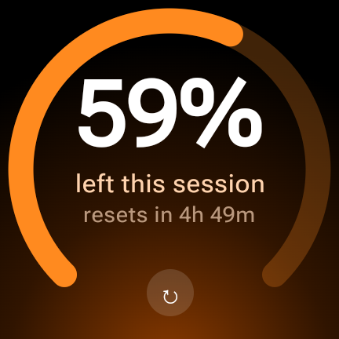
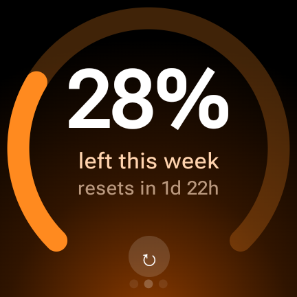
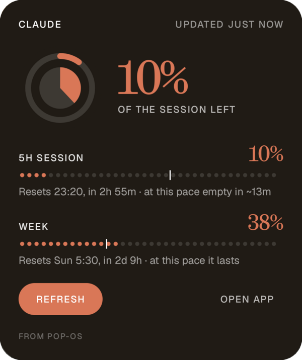
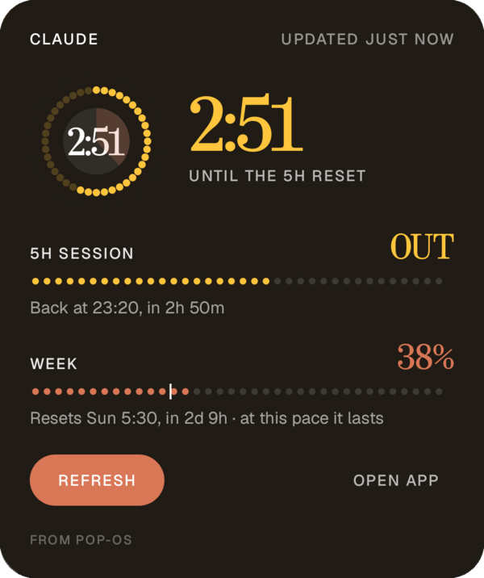
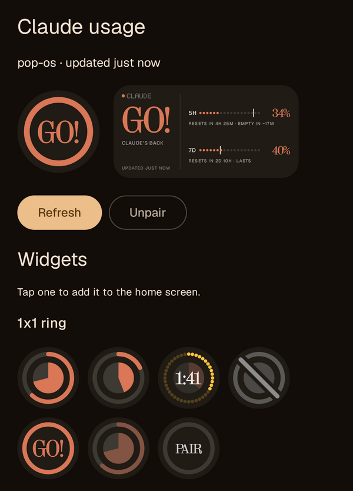

# AIusageBar

GNOME top-bar indicator for [Claude Code](https://claude.com/claude-code) usage. Written in Go.

The same numbers reach your wrist and your phone through the bridge
(`-serve`): a Wear OS app lives in [`wearos/`](wearos/), and Android
home-screen widgets are in a separate app, still private and a work in
progress.

| Wear OS: session | Wear OS: week |
| :---: | :---: |
|  |  |

| Android widget | Out of session: countdown to the reset | Widget picker in the app |
| :---: | :---: | :---: |
|  |  |  |

- Tray icon = colored dot (green/orange/red) by how close you are to your
  worst plan limit. Tray text = `5h NN% · 7d NN%`.
- Click menu shows:
  - **Session (5h)** and **Week (7d)** limit utilization and when each resets
    - read straight from Anthropic's own cached usage data in `~/.claude.json`
      (the same numbers Claude Code itself shows you), so the percentages and
      reset times are exact, not estimated.
  - **API-cost equivalent** for today / this session / this week - what the
    same token usage would have cost on pay-as-you-go API pricing, computed
    from the token counts logged in `~/.claude/projects/**/*.jsonl` using
    current per-model Anthropic pricing (updated 2026-09). Each reply is
    counted once: Claude Code writes a transcript line per content block, all
    repeating the reply's usage, so lines are deduplicated by message id +
    request id. Cache reads use each model's own rate (Opus 5.5 and Fable 5.1
    aren't the usual 0.1x), and 1-hour cache writes are 2x input. T3 Code
    prices every cache write at the 5-minute 1.25x rate, so it shows a little
    less for the same usage.
- Refreshes every 30s, or on demand via the "Refresh" menu item.
- Can also serve the same numbers over your LAN (`-serve`) as JSON, for other
  devices on the network.

Subscription plans (Pro/Max) don't expose a dollar limit or a metered
balance - only a percentage of your session/weekly allowance. The cost
figure here is a separate, independent estimate of value, not what you're
being billed.

## Build

```sh
go build -o aiusagebar .
```

Needs Go 1.22+, a C compiler (`gcc`), and GTK/AppIndicator dev headers for
the tray (same class of dependency the old GTK version needed):

```sh
sudo apt install build-essential libgtk-3-dev libayatana-appindicator3-dev
```

## Run

```sh
./aiusagebar
```

## Serve usage over the LAN

The same snapshot the tray shows can be served as JSON, so anything else on the
network can read it - that's how the Wear OS companion
([`wearos/`](wearos/)) gets its numbers:

```sh
./aiusagebar -serve :8765              # tray + JSON bridge
./aiusagebar -headless -serve :8765    # bridge only, no tray
./aiusagebar -serve :8765 -token s3cr3t  # require a shared secret
```

On startup the process logs every LAN address it is reachable on, and advertises
itself over mDNS as `_aiusage._tcp` (via `avahi-publish-service`) so a client can
find it without anyone typing an IP address. `-mdns=false` turns that off.

### Endpoints

| Endpoint | What it does |
| --- | --- |
| `GET /usage` | current snapshot, refreshed first if it's stale (see **Freshness**). Sends an `ETag`; send it back as `If-None-Match` to get `304` when nothing has changed |
| `GET /events?since=<id>` | alert events (threshold crossings, window resets) newer than `<id>`, plus the new `high_water` mark |
| `POST /pair` `{"code":"123456"}` | redeems a pairing code for a per-device token (plus `public_url`, if set) |
| `GET /healthz` | liveness, no auth, no usage data. Says whether a token is needed |

```json
{
  "schema": 1,
  "five_hour": {"utilization": 53, "remaining": 47, "resets_at": "2026-09-21T18:20:00Z", "resets_in_sec": 16631},
  "seven_day": {"utilization": 41, "remaining": 59, "resets_at": "2026-09-27T00:00:00Z", "resets_in_sec": 469031},
  "cost_today": 251.02, "cost_session": 25.06, "cost_week": 351.44,
  "generated_at": "2026-09-21T13:43:29Z", "cache_fetched_at": "2026-09-21T13:43:12Z", "host": "pop-os"
}
```

The `ETag` deliberately ignores `generated_at` and `resets_in_sec`: they change
on every poll but carry no news, and a `304` over a Bluetooth proxy is nearly
free next to a full body. A `304` means "your copy is still current *now*", so
treat the fetch time, not `generated_at`, as the freshness clock.

### Freshness

The limits come from Claude Code's cache in `~/.claude.json`, which only moves
when Claude Code fetches usage, normally during a session. So asking is
refreshing: when a client calls `GET /usage` and that cache is more than a
minute old, the bridge first runs the official CLI's local `/usage` command
(`claude -p /usage`; no model call, a couple of seconds), which makes Claude
Code fetch current numbers, and then answers. That's at most one CLI run a
minute however many clients ask, and concurrent requests share it. A client's
refresh button and its background poll are the same request; there's no
separate refresh endpoint.

`cache_fetched_at` is when Claude Code last fetched the limits, so the true age
of the numbers. The bridge never talks to Anthropic itself.

```sh
./aiusagebar -serve :8765 -refresh-min-age 5m     # refresh less eagerly
./aiusagebar -serve :8765 -refresh-min-age 0      # never; serve the cache as Claude Code leaves it
./aiusagebar -serve :8765 -claude /opt/bin/claude # if claude isn't on PATH or in ~/.local/bin
```

`resets_at` is rounded to the minute: Anthropic's value wobbles by a second
between fetches, which would otherwise look like the window rolling over.

### Alerts

The bridge is the only thing that decides an alert; clients just render what
they're told. Crossing 80%, 95% or 100% (exhausted) on either window raises an
event, and so does a window resetting. One crossing produces exactly one event: it re-arms only
when the window rolls over or utilization falls `-hysteresis` points back below
the line, and the arming state is persisted, so restarting the bridge doesn't
replay history.

```sh
./aiusagebar -serve :8765 -thresholds 80,95,100 -hysteresis 5
```

Cost is deliberately not alertable - it's an independent estimate of value, not
a bill, and a "you've spent $X" notification would imply a charge that isn't
happening.

### Pairing a device

Typing a 32-character token on a watch is not a plan. Instead:

```sh
./aiusagebar -pair          # asks the running bridge for a code, prints it
```

(or click **Pair a device…** in the tray menu). The bridge prints a 6-digit
code, good for one use and two minutes; the device posts it to `/pair` and gets
back its own token. Ten wrong codes in a row burn every pending code, so the
6-digit space can't be walked.

Codes are minted only over a Unix socket (`$XDG_RUNTIME_DIR/aiusagebar.sock`,
mode 0600), never over HTTP. A tunnel or reverse proxy on this machine delivers
internet traffic from `127.0.0.1`, so a "loopback only" HTTP endpoint would let
anyone who can reach the tunnel mint a code. The socket is reachable only by
your own user. **Pairing one device closes the bridge**: once any device is
paired, unauthenticated requests get a `401`, and each device's token can be
revoked on its own by deleting it from the state file.

State - device tokens, the event ring, alert arming - lives in
`$XDG_STATE_HOME/aiusagebar/state.json` (mode 0600), usually
`~/.local/state/aiusagebar/state.json`.

The bridge itself is plain HTTP with no transport security. On the LAN, keep it
to a trusted network. To reach it from anywhere, put TLS in front with a tunnel:

## Reach it from anywhere

Either tunnel works; the bridge doesn't care which one is in front of it. Run it
with `-public-url` set to the tunnel's address either way.

### Tailscale Funnel (no domain needed)

Free, with a stable `https://<machine>.<tailnet>.ts.net` address and TLS
included. Funnel exposes only the port you give it, not the rest of the machine
or your tailnet, and clients don't need Tailscale installed.

```sh
curl -fsSL https://tailscale.com/install.sh | sh
sudo tailscale up
sudo tailscale funnel --bg 8765      # prints the public URL; persists across reboots
./aiusagebar -serve :8765 -public-url https://<machine>.<tailnet>.ts.net
```

`sudo tailscale funnel reset` turns it off. Funnel forwards every path, which
is fine: `/pair/new` doesn't exist on TCP, and everything else needs a token.

### Cloudflare Tunnel (needs a domain)

A [Cloudflare named tunnel](https://developers.cloudflare.com/cloudflare-one/connections/connect-networks/)
gives the bridge a stable `https://` hostname without opening a port on your
router. Cloudflare terminates TLS; `cloudflared` on this machine forwards to the
bridge on loopback. It needs a Cloudflare account and a domain on it. The free
"quick tunnel" (`trycloudflare.com`) won't do: its hostname changes every
restart, and the watch needs one that stays put.

The quick way, which does everything below (login, tunnel, DNS, a config that
only forwards the bridge's routes, a user-level systemd service, and autostart
flags):

```sh
scripts/setup-tunnel.sh usage.example.com
```

Or by hand (`usage.example.com` is your hostname):

```sh
cloudflared tunnel login                      # opens a browser, picks the domain
cloudflared tunnel create aiusage             # prints the tunnel UUID
cloudflared tunnel route dns aiusage usage.example.com
```

`~/.cloudflared/config.yml`:

```yaml
tunnel: <UUID>
credentials-file: /home/<you>/.cloudflared/<UUID>.json
ingress:
  # Only the bridge's public routes cross the tunnel; everything else 404s.
  - hostname: usage.example.com
    path: ^/(usage|events|pair|healthz)$
    service: http://127.0.0.1:8765
  - service: http_status:404
```

Then run both:

```sh
cloudflared tunnel run aiusage
./aiusagebar -serve :8765 -public-url https://usage.example.com
```

`-public-url` does two things:

- **Every request needs a credential from the start.** Without it, an unpaired
  bridge answers anyone; with it, the internet can reach the port, so `/usage`
  and `/events` return `401` until a device has paired.
- **It's handed to devices when they pair.** A watch pairs once on home Wi-Fi,
  where it finds the bridge over mDNS, and the `/pair` response tells it the
  public URL to use from then on. Nobody types a hostname on a watch.

Send the token as `Authorization: Bearer …`, not `?token=`: query strings end up
in proxy logs. Keep `-serve :8765` (all interfaces) if you want LAN pairing; bind
`127.0.0.1:8765` instead to make the tunnel the only way in, at the cost of
pairing through the public URL.

`cloudflared service install` runs the tunnel at boot (see Cloudflare's docs; it
reads `/etc/cloudflared/config.yml`).

### Don't rely on an unguessable hostname

Every HTTPS certificate is published in Certificate Transparency logs, and
scanners watch them, so a public hostname is found within minutes however
random it is. The token is what protects the bridge. It's invisible in use,
because a client pairs once and sends the token from then on.

## Writing another client

Anything can read the bridge, not just the watch. Here's the whole integration:

1. **Find it.** On the LAN, browse mDNS for `_aiusage._tcp`, or use the
   host's address on port 8765. From anywhere, use the public URL.
2. **Pair once.** Run `aiusagebar -pair` (or use **Pair a device…** in the tray)
   to get a 6-digit code, then:
   ```sh
   curl -X POST https://<public-url>/pair -d '{"code":"123456","name":"my-thing"}'
   # → {"token":"…","device_id":"…","host":"pop-os","public_url":"https://…"}
   ```
   Store the token. If you paired on the LAN, switch to `public_url` for later
   requests.
3. **Read.** Send `Authorization: Bearer <token>` on every request, never
   `?token=`. Poll `GET /usage` with `If-None-Match: <last ETag>`: a `304`
   means nothing changed. For notifications, poll `GET /events?since=<high_water>`
   and deduplicate by `dedupe_key`. The bridge is the only thing that decides
   an alert, so don't re-derive thresholds in your client.
4. **Handle** `401` as "pair again"; your device was revoked or the state was
   reset. Use `GET /healthz` (no auth) to check the bridge is up.

Rules of thumb:
- Date your data from when you fetched it, not from `generated_at`; or
  better, from `cache_fetched_at` when it's there.
- Don't add a refresh button that does anything but `GET /usage`: that
  request already refreshes.
- Take reset times only from `resets_at`.
- Never label the cost numbers as a bill.

Each client gets its own token. Revoke one by deleting its entry from
`state.json` and restarting the bridge.

## License

[PolyForm Noncommercial 1.0.0](LICENSE.md). It covers everything here,
including the Wear OS app in `wearos/`. You may use, change and share it for
any noncommercial purpose: personal use, research, hobby projects, and
charitable, educational or public-interest organisations. Commercial use needs
permission from the copyright holder.

## Start on login

```sh
cp aiusagebar.desktop ~/.config/autostart/
```

(Edit the `Exec=` path in `aiusagebar.desktop` first if you build/install the
binary somewhere other than this directory.)
